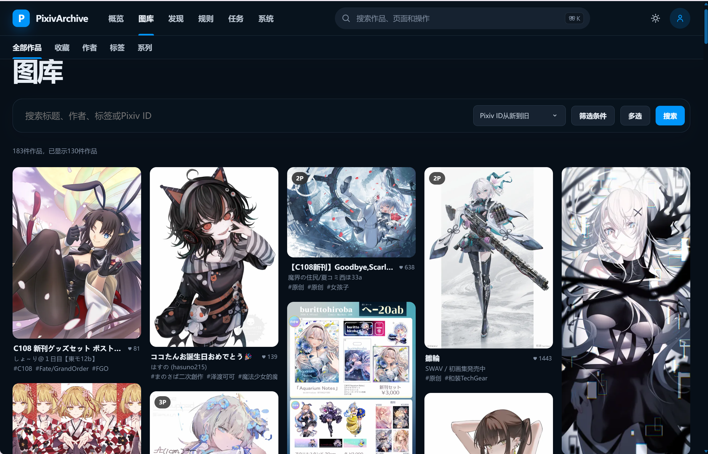
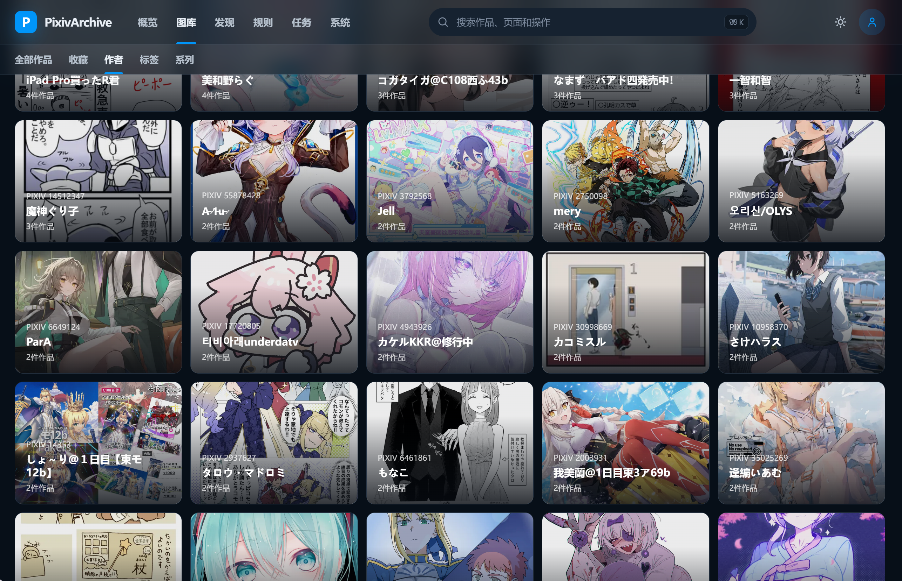
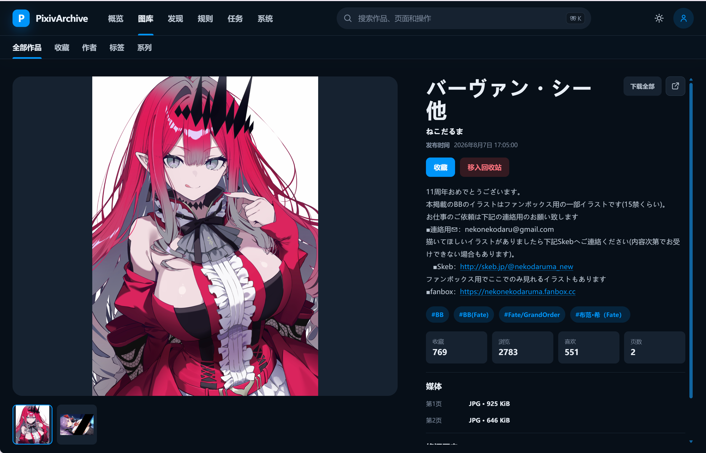
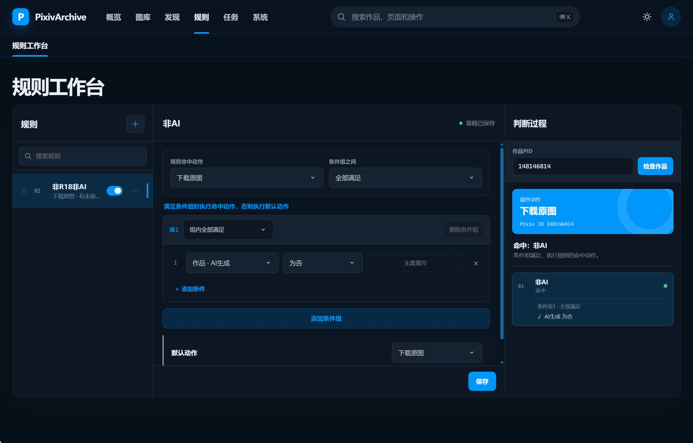
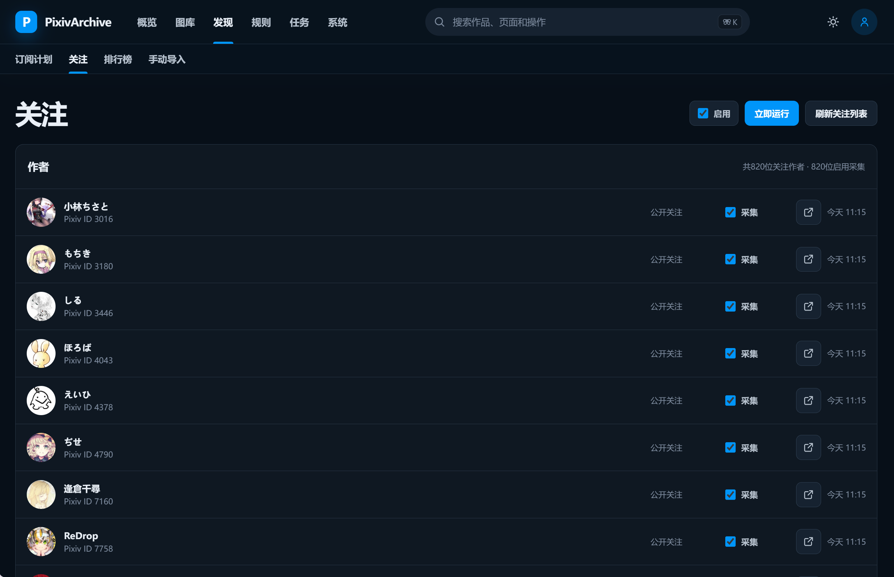
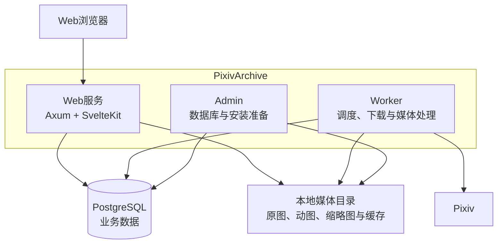

<div align="center">


# PixivArchive

[](https://github.com/Mizuno-Sachiko/PixivArchive/releases)
[](https://github.com/Mizuno-Sachiko/PixivArchive/pkgs/container/pixivarchive)
[](LICENSE)
[](https://www.rust-lang.org/)
[](https://svelte.dev/)

**面向个人收藏的Pixiv采集、筛选与本地图库**

</div>

---

## 简介

PixivArchive是一套为个人使用设计的Pixiv收藏和归档工具。它可以自动保存排行榜作品、关注用户的新作和你在Pixiv收藏的作品，也可以手动导入单个作品或某位作者的全部作品。下载后的插画、漫画和Pixiv动图都可以在本地浏览和管理。

项目使用Rust和SvelteKit开发。作品信息等数据保存在PostgreSQL中，图片等媒体文件保存在指定的本地目录。

## 界面预览

### 图库



| 作者目录 | 作品详情 |
| --- | --- |
|  |  |

| 规则工作台 | 关注订阅 |
| --- | --- |
|  |  |

## 系统架构



### 组件概览

| 组件 | 技术栈 | 职责 |
|------|--------|------|
| Web | Rust、Axum、SvelteKit | 登录、图库、规则、订阅、任务、系统设置与媒体读取 |
| Worker | Rust、Tokio、libvips | 订阅调度、规则判断、下载、缩略图、回收站与后台维护 |
| Admin | Rust、SQLx | 执行内嵌迁移、准备安装数据并同步管理员密码 |
| 数据库 | PostgreSQL | 保存业务数据、任务状态、订阅游标与删除标记 |
| 媒体存储 | 本地文件系统 | 保存来源文件、派生图、暂存文件、缓存与Cookie加密密钥 |

## 功能特性

### 发现与采集

- 订阅Pixiv排行榜、关注动态与公开/非公开收藏
- 手动导入单个作品或作者全部作品
- 支持默认下载、强制下载和按已发布规则导入
- 为每位关注作者单独设置是否自动保存新作
- 从Pixiv同步全部关注作者
- Pixiv账户状态验证与可选的收藏写回

### 规则与任务

- 使用条件组、字段类型和操作符组合下载规则
- 规则草稿、JSON导入、排序、发布版本和带判断追踪的测试
- 统一查看任务状态，并对支持的任务执行重试或取消

### 图库与媒体

- 按作品、作者、标签、系列和本地收藏浏览
- 搜索全部已归档的作品和作者
- 按条件筛选作品，并在瀑布流图库中连续浏览
- 按内容分级遮挡缩略图
- 查看插画、漫画和Pixiv动图，保留来源原图与原始动图帧ZIP
- 生成WebP或AVIF缩略图，支持原始文件和作品归档下载

### 安全与维护

- 单管理员登录、Argon2id密码存储、CSRF与会话管理
- Pixiv Cookie保存
- 保存多个Pixiv账户身份，切换当前账户时隔离各自的收藏状态和收藏写回
- 回收站延迟删除、恢复、改期、立即清理与定期清理

## 部署指南

### 环境要求

- Docker部署：Docker Engine和Docker Compose
- 原生部署：x86_64 Linux、Bash、curl、PostgreSQL和提供`vipsthumbnail`命令的libvips
- 一个已经存在并具有足够空间的媒体目录
- 能够访问Pixiv；需要时可以为Web与Worker配置相同代理

### Docker快速开始

```bash
git clone https://github.com/Mizuno-Sachiko/PixivArchive.git
cd PixivArchive
cp .env.example .env
```

编辑`.env`，至少设置管理员密码、数据库密码和宿主机媒体目录：

```dotenv
PIXIVARCHIVE_ADMIN_PASSWORD='请设置管理员密码'
PIXIVARCHIVE_MEDIA_HOST_PATH=/mnt/storage/pixivarchive
PIXIVARCHIVE_WEB_BIND=0.0.0.0:7088
POSTGRES_PASSWORD='请设置数据库密码'
```

媒体目录必须在启动前创建。

```bash
mkdir -p /mnt/storage/pixivarchive
docker compose up -d
```

启动完成后访问`http://服务器地址:7088`。管理员用户名固定为`admin`，密码来自`PIXIVARCHIVE_ADMIN_PASSWORD`。

```bash
# 查看服务
docker compose ps
docker compose logs -f web worker

# 停止服务并保留数据
docker compose down
```

`docker compose down`不会删除PostgreSQL命名卷和宿主机媒体目录。只有明确需要删除数据库数据时才使用`docker compose down -v`。

### Docker本地构建

`compose.yaml`使用当前版本的GHCR预构建镜像。需要从当前源码构建时，叠加`compose.build.yaml`：

```bash
docker compose -f compose.yaml -f compose.build.yaml up -d
```

本地构建只生成一次`pixivarchive:local`，准备任务、Web和Worker复用同一镜像。PostgreSQL、媒体挂载、代理和启动顺序继续由`compose.yaml`定义。

### 服务组成

| 服务 | 对外端口 | 描述 |
|------|----------|------|
| `postgres` | 无 | PostgreSQL数据库，数据保存在命名卷中 |
| `prepare` | 无 | 一次性执行数据库迁移、安装准备和密码同步 |
| `web` | `7088` | Web界面、API和媒体读取 |
| `worker` | 无 | 后台采集、下载和媒体处理 |

### 原生Linux Release

不使用Docker时，从[GitHub Releases](https://github.com/Mizuno-Sachiko/PixivArchive/releases)下载`pixivarchive-linux-x86_64.tar.gz`及其SHA-256校验文件：

```bash
sha256sum -c pixivarchive-linux-x86_64.tar.gz.sha256
tar -xzf pixivarchive-linux-x86_64.tar.gz
cd pixivarchive
cp .env.example .env
```

在`.env`中设置`DATABASE_URL`、`PIXIVARCHIVE_MEDIA_ROOT`和管理员密码，保持`POSTGRES_PASSWORD`注释，然后启动：

```bash
bash start.sh
```

停止服务：

```bash
bash stop.sh
```

原生压缩包内容：

```text
pixivarchive/
├── bin/
│   ├── pixivarchive-admin
│   ├── pixivarchive-web
│   └── pixivarchive-worker
├── frontend/
├── .env.example
├── LICENSE
├── start.sh
├── stop.sh
├── upgrade.sh
├── README.md
└── SOURCE_STATE
```

### 升级

Docker与原生Linux Release使用两套独立的升级流程。启动时`prepare`会在Web和Worker之前执行尚未应用的数据库迁移；`.env`、PostgreSQL数据和媒体目录保持原位。

#### Docker升级

在Docker源码目录中运行：

```bash
docker compose down
git pull --ff-only
docker compose pull
docker compose up -d
```

#### 原生Linux Release升级

原生Release目录不包含Git元数据。在安装目录中停止当前进程，再运行带明确覆盖标志的升级脚本：

```bash
bash stop.sh
bash upgrade.sh --latest --force
```

`--latest`会解析GitHub最新稳定Release并显示实际版本。需要固定版本或回退时，可以传入明确的版本标签，例如`bash upgrade.sh v1.2.3 --force`。

## 配置说明

### 核心配置

| 变量 | 使用场景 | 必需 | 默认值 | 描述 |
|------|----------|------|--------|------|
| `PIXIVARCHIVE_ADMIN_PASSWORD` | 全部 | 是 | - | 固定管理员`admin`的密码 |
| `PIXIVARCHIVE_MEDIA_HOST_PATH` | Docker | 是 | - | 宿主机媒体目录，必须是已经存在的绝对路径 |
| `PIXIVARCHIVE_MEDIA_ROOT` | 原生 | 是 | - | 应用读取的媒体根目录 |
| `PIXIVARCHIVE_WEB_BIND` | 全部 | 否 | `0.0.0.0:7088` | Web监听地址和端口 |
| `POSTGRES_PASSWORD` | Docker | 是 | - | Compose创建的PostgreSQL用户密码 |
| `DATABASE_URL` | 原生 | 是 | - | PostgreSQL连接地址 |
| `RUST_LOG` | 全部 | 否 | `pixivarchive=info,tower_http=info` | 日志过滤级别 |

### 代理配置

| 变量 | 描述 |
|------|------|
| `HTTP_PROXY` | HTTP代理 |
| `HTTPS_PROXY` | HTTPS代理 |
| `ALL_PROXY` | 通用代理，例如SOCKS5 |
| `NO_PROXY` | 不使用代理的地址，Docker中应包含`postgres` |

Docker容器中的`127.0.0.1`指当前容器。宿主机代理需要填写容器能够访问的宿主机地址或局域网地址。

## 数据存储

Docker把`PIXIVARCHIVE_MEDIA_HOST_PATH`挂载到容器内固定的`/data/media`。宿主机目录可以位于任意硬盘；系统设置中的Docker媒体路径应保持`/data/media`。Compose使用`create_host_path: false`，外部硬盘未挂载或目录不存在时会停止启动。

```text
<media-root>/
├── originals/
│   └── pixiv/
│       └── <author-id>/
│           └── <work-id>/
│               ├── <work-id>_p0_r0001.png
│               └── <work-id>_ugoira_r0001.zip
├── derivatives/
│   └── pixiv/
│       └── <author-id>/
│           └── <work-id>/
├── staging/
└── .pixivarchive/
    ├── cache/
    └── pixiv-cookie.key
```

数据库只保存相对于媒体根目录的路径。迁移、备份或更换硬盘时，需要同时保存PostgreSQL数据和整个媒体目录，包括隐藏的`.pixivarchive`目录。

## 项目结构

```text
PixivArchive/
├── apps/
│   ├── admin/             # 安装准备与契约导出
│   ├── web/               # Web服务与API
│   └── worker/            # 后台任务执行器
├── crates/
│   ├── domain/            # 领域模型与规则引擎
│   ├── application/       # 用例编排与事务边界
│   ├── db/                # SQLx仓库与数据库事务
│   ├── pixiv/             # PixivHTTP适配器
│   └── media/             # 媒体路径、下载与派生处理
├── frontend/              # SvelteKit静态前端
├── migrations/            # PostgreSQL初始架构
├── openapi/               # OpenAPI契约
├── scripts/               # 构建、验证与发布脚本
├── compose.yaml           # Docker预构建部署
├── compose.build.yaml     # Docker本地构建叠加配置
├── Dockerfile
└── .env.example
```

构建Linux原生Release：

```bash
bash scripts/build-release.sh
```

## 许可证

本项目基于MIT许可证开源。详见[LICENSE](LICENSE)文件。

## 致谢

- [Rust](https://www.rust-lang.org/)——服务端语言与工具链
- [Axum](https://github.com/tokio-rs/axum)——Web框架
- [SQLx](https://github.com/launchbadge/sqlx)——PostgreSQL访问与迁移
- [SvelteKit](https://svelte.dev/docs/kit)——Web界面
- [libvips](https://www.libvips.org/)——缩略图与媒体处理

## 支持

- [报告问题](https://github.com/Mizuno-Sachiko/PixivArchive/issues)
- [参与讨论](https://github.com/Mizuno-Sachiko/PixivArchive/discussions)
